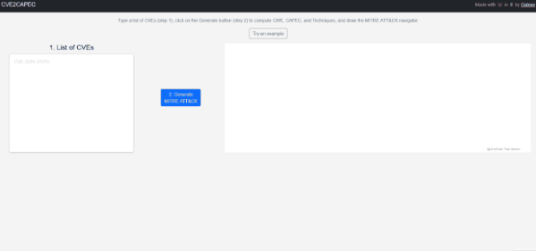

<a name="readme-top"></a>
<div align="center">
  <h1 align="center">CVE2CAPEC</h1>
  <p align="center">
    <a href="https://www.python.org/"></a>
    <a href="https://github.com/Galeax/CVE2CAPEC"></a>
    <a href="https://galeax.github.io/CVE2CAPEC/"></a>
    <br/><br/>
    Get CVE, CWE, CAPEC, and MITRE ATT&CK Techniques data automatically.
    <br/>
    Try it online at <a href="https://galeax.github.io/CVE2CAPEC/">https://galeax.github.io/CVE2CAPEC/</a>.
  </p>
</div>

<!-- TABLE OF CONTENTS -->
<details>
  <summary>Table of contents</summary>
  <ol>
    <li><a href="#introduction">Introduction</a></li>
    <li>
      <a href="#installation">Installation</a>
    </li>
    <li><a href="#usage">Usage</a>
      <ul>
        <li><a href="#update-databases">Update databases</a></li>
        <li><a href="#get-new-cves">Get new CVEs</a></li>
        <li><a href="#license">License</a></li>
        <li><a href="#contact">Contact</a></li>
      </ul>
     </li>
  </ol>
</details>

## Explore this repo data with our MITRE ATT&CK generator

Data generated by this project also serve the interactive MITRE ATT&CK generator available at <a href="https://galeax.github.io/CVE2CAPEC/">https://galeax.github.io/CVE2CAPEC/</a>.

[](https://galeax.github.io/CVE2CAPEC/)

<p style="text-align:center;"><a href="docs/cve2capec.gif" style="color:#aaaaaa;">click here for HD version</a></p>


## Introduction 

This project allows you to manage get all new CVE with their CWE, CAPEC and [MITRE ATT&CK](https://attack.mitre.org/) Techniques.
All CVE data are stored in `database` folder.

**CVE2CAPEC does not need to be run by yourself.**
In fact, github actions update the database every day at 00:05 UTC so you can get the new CVE with all their data in `results/new_cves.jsonl`.

However, if you want to run this project by your own : 

### Installation

```sh
git clone https://github.com/Galeax/CVE2CAPEC.git
cd CVE2CAPEC
pip install -r requirements.txt
```

### Update databases

```sh
python update_capec.py
python update_cwe.py
python update_technique.py
```

### Build the CVE - CWE - CAPEC - MITRE ATT&CK Techniques links

 **1. Get new CVEs**
```sh
python retrieve_cve.py
```
**2. Get CWEs from new CVEs**
```sh
python cve2cwe.py
```
**3. Get CAPECs from CWEs**
```sh
python cwe2capec.py
```
**4. Get MITRE ATT&CK Techniques from CAPECs**
```sh
python capec2technique.py
```

## License

This project is released under the MIT license.

## Contact

Made with ❤️ in 🇫🇷 by <a href="https://galeax.com">
