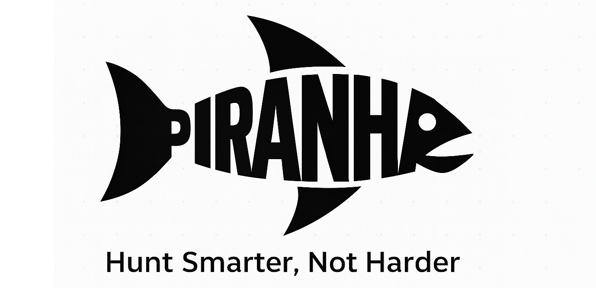

# PIRANHA 🐟  



Piranha is an advanced cyber threat analysis and hunt planning tool that bridges the gap between intelligence analysts and defensive cyber operators. By simplifying the translation of Priority Intelligence Requirements (PIRs) into actionable hunt strategies, Piranha accelerates mission planning, enhances detection coverage, and supports data-driven decision making in cyber defense operations.

---

## 🔍 Key Features

- **APT-Centric Analysis**  
  Select one or more APTs to instantly retrieve their associated MITRE ATT&CK tactics and techniques, including overlaps and patterns.

- **IoM Graph Viewer**  
  Visualize attack behavior using Indicators of Methodology (IoMs), with graph-based tracking of adversary TTP overlap.

- **Tactic Optimization Engine**  
  Input a desired number of tactics and receive an optimized combination that closely aligns with an ideal detection strategy.

- **Radar Chart Visualization**  
  See how a threat profile or hunt plan distributes across data component categories:  
  - Host Collection  
  - Network Collection  
  - Host Interrogation  
  - Memory Analysis

- **Nessus Scan Integration**  
  Import Nessus XML scans to:
  - Extract CVEs and map to ATT&CK techniques using `cve2capec`.
  - Generate heatmaps based on APT usage, CVSS scores, and detection relevance.

- **Threat Profile Builder**  
  Define reusable profiles by combining APTs, tactics, and techniques for mission-specific or domain-focused threat modeling.

- **Compare to Profile**  
  Match imported scans against threat profiles and calculate a match score using F1 comparison logic.

- **Extra Tools**
  - Quick CVE mapper
  - Automated CVE -> Technique DB Updating.
  - AI Enrichment
---

## 🧠 Why Piranha?

Cyber intel teams often know **who** the threat actor is and **what** they're trying to do, but lack the technical time or tooling to pivot that into an effective hunt plan. Piranha simplifies this process by:

- Automatically mapping APTs to techniques and tools.
- Suggesting ideal tactic combinations based on analyst goals.
- Enabling live visual and data-driven analysis.
- Bridging data silos between threat intelligence and network defense.
---

## To Do
- Add support for multiple GPTs

## 📦 Installation

```bash
git clone https://github.com/williamjsmail/piranha
cd piranha
pip install -r requirements.txt
python piranha.py
```

**Note on Headless Environments:**

If you are running Piranha in a headless environment (e.g., on a server without a graphical interface), you may need to install additional dependencies and set an environment variable.

First, install the required Qt dependencies:
```bash
sudo apt-get install -y '^libxcb.*-dev' libx11-xcb-dev libglu1-mesa-dev libxrender-dev libxi-dev libxkbcommon-dev libxkbcommon-x11-dev
```

Then, run the application with the `QT_QPA_PLATFORM` environment variable set to `offscreen`:
```bash
QT_QPA_PLATFORM=offscreen python piranha.py
```

## Repository Maintenance

This repository was repaired to address several critical issues, including:

*   **File Path Issues:** The application was unable to locate its data files due to inconsistent and incorrect file path construction. This was resolved by standardizing all file path access through a robust `resource_path` utility function.
*   **Python Virtual Environment:** The application was failing to run due to issues with the Python virtual environment. These issues were a symptom of the underlying file path problems and were resolved by fixing the file paths and installing the necessary Qt dependencies.
